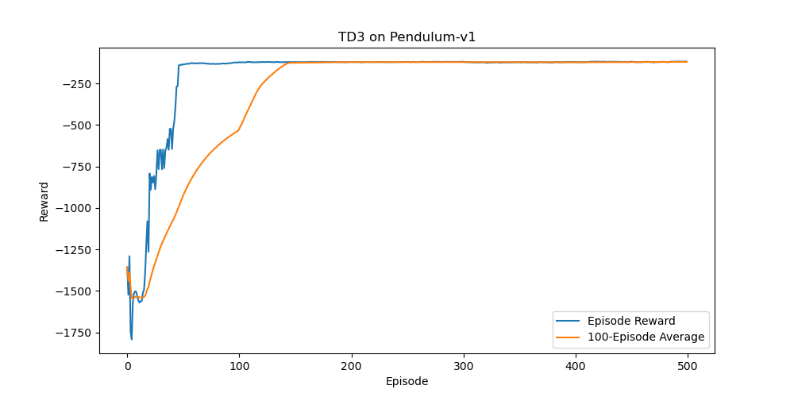

# Robot Learning Hub

A curated collection of my practice implementations in **Reinforcement Learning** and **Imitation Learning**,
organized for readability and quick review.

> Focus: RL/IL fundamentals + MuJoCo practice + small IL/IRL/offline-RL experiments.

## Highlights (recommended entrypoints)
### RL 

### MuJoCo (practice)

### IL / IRL / Offline RL (practice)

